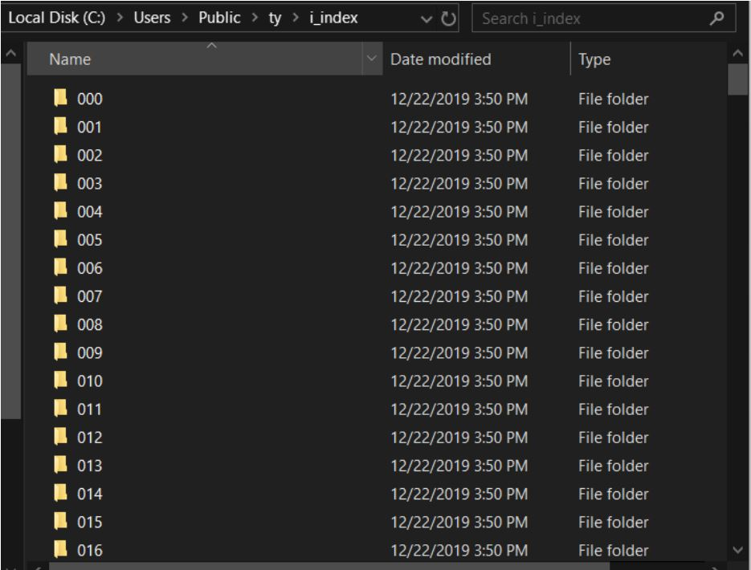
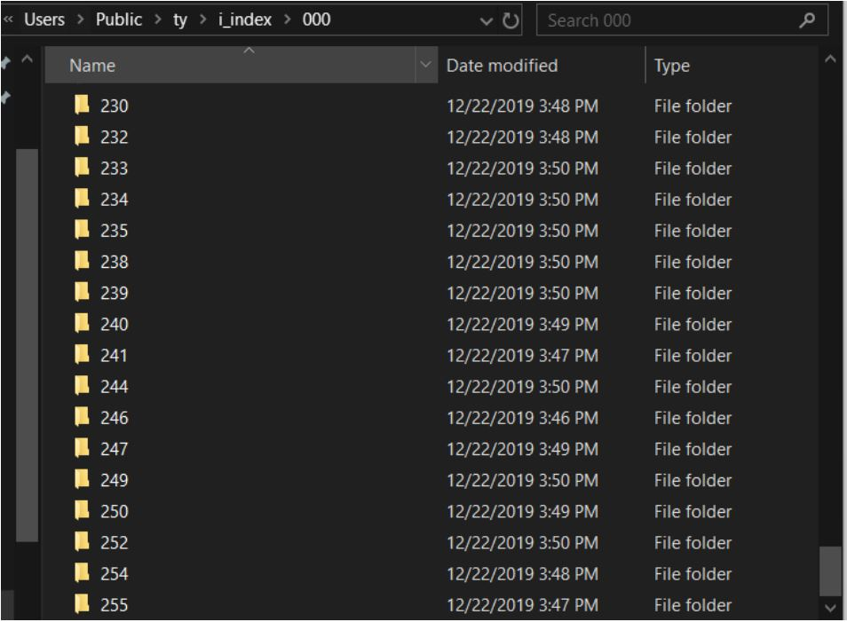
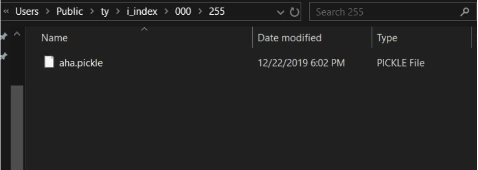
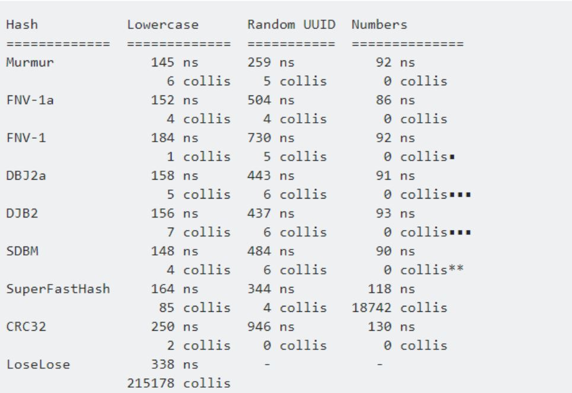
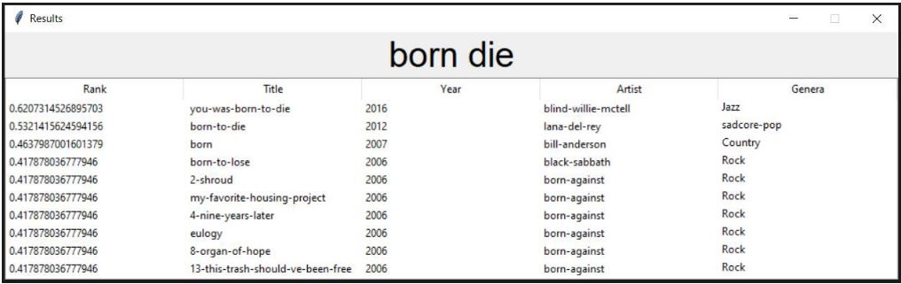
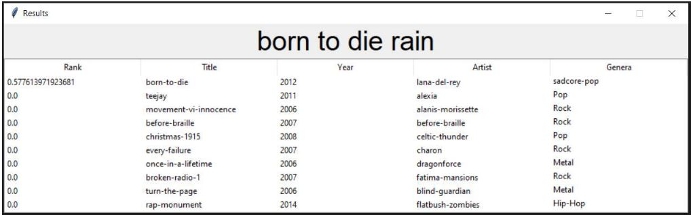
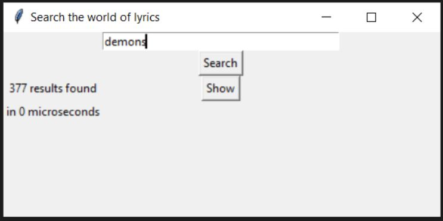
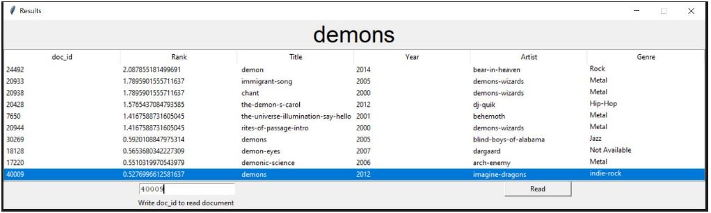

##### NOTE
~~This repo is not complete, some parts of it are lost, some are different.~~

### Dataset
Dataset used for this search engine is that of 380000 MetroLyric Songs.
[Link](https://www.kaggle.com/gyani95/380000-lyrics-from-metrolyrics) of dataset.

### Dataset Bugs
The dataset given above is faulty, it has many places where rows of one field got mixed into another

TO see the fault open file converted in utf-8 , .csv format and search
(I promise to kill them all til everybody's misse)
after this line there should be a new document (following csv format) but there is not tag/pattern for new file
You can fix it but checking that single quotation mark (") should only come in start of row and at end of it,
every other single quotation in between these two should be escaped using one more quotation i.e ("").
<br/>

```
Some of the bugs that needed to be fixed are shown in the bugs folder.
```

<br/>


# Structure for Code

## Directory Structure and Log Files
To make search engine to `scale` to huge amount of data of same structure as that of mentioned dataset directory structures are well utilized and organized in code. You just have to pass four paths:
<br/>

```
folder where dataset is present
folder where to store/retrieve forward index
folder where to store/retrieve inverted index
folder where to generate log files
```

<br/>

 `Log Files` are being generated to keep track of data files that are being processed and those which are not processed.
 Within `Log` folder two sub folders are generated :

 <br/>

 ```
 One to store logs for forward indexes
 One to store logs for inverted indexes
 ```

 <br/>

 ### Dynamic Flow of Program
 To make sure smooth execution of program for an **indefinite** amount of time, forward index generation and inverted index generation are kept `independent` of eachother yet both programs are co-dependent on each others output. Once you run the program, the forward indexer check logs from its logs directory and see which files in dataset directory are indexed and which need to be indexed, it also have access to directory where indexed files are kept. If yet inverted indexer has not done its work then it will wait for inverted indexer, once inverted indexer has finished one file, its information will be logged, and now forward indexer will know that there is/are new files to be worked on. Forward indexer and inverted indexer simultaneously will do their own work. Even if a crawler is added and keeps adding new data while maintaining the directory structire followed even then the program keeps running and there won't be any need for manually changing folders or for stopping program adding data and running it again or running forward indexer first then running inverted indexer....no such mess.

<br/>

 ### Directories

 <pre>

 <i>all directories stored in helper file</i>

 	 	<b>i_index_dir </b>  	 	     :  base directory of inverted index 
 	 	<b>f_index_main_dir</b>  	     : base directory of forward index 
 	 	<b>docs_subdir_log</b>  	     : log of forward indexed docs 
 	 	<b>i_log</b>  	 	 	     : log of inverted indexed docs 
 	 	<b>docs_path</b>  	 	     : path where data_set is stored either in separate files or a  
 	 	 	 	 	                          single huge file.                                                               
 	 	<b>stopwords_path</b>  	     : path of stopwords file 

</pre> 

### High level Pseudo Code
###### indexer
<br/>
```
while 1: 
index() index() 
```
<br/>

###### index()


```
f_process = multiprocessing.Process( target = f_placer() ) 
i_process = multiprocessing.Process( target = i_placer() ) 
```
<br/>

###### f_placer()


```

# docs = [ name of all documents from dos_path ]
# indexed_docs = { documents that are already indexed, from docs_subdir_log } 
# f_index_folders = [name of all folders in f_index directory] 
for doc in docs not in indexed_docs:
                                    get_out_path_for_f_index ( doc, f_index_folder )
                                    path_of_nth_doc = docs_path + "\\" + str ( doc )
                                    forward_indexer ( stopwords_path, path_of_nth_doc, output_path ) 
                                    if forward_indexer return 0 update sub_dir_log
```

<br/>

###### forward_indexer ( stopwords_file, data_set, output_file )

```
read stop words file 
open targeted file 
    read it doc by doc 
    lowercase all words 
    substitute non alphanumeric with space 
    tokenize 
    remove stopwords 
    stem each token 
    enumerate through tokens and create desired dict pattern 
            #like ( { ‘word’ : [ location_weight, x ], ‘word_n’ : [ location_weight, x ] } )
    out_batch_of_file = out_batch_of previous docs + ”,” + doc_no + ”,” + doc_size + ”,” forward_batch + ”\n”
write forward_index onto file
```
<br/>

###### i_placer ( )


``` dir_dic_f = get_sub_dir_of_findex( docs_subdir_log ) 
i_dict = read_ilog() 
for key in dir_dict_f :
    if key not in i_dict : 
        f_index = f_index_main_dir + "\\" + dir_dict_i[key] + "\\" + key 
        inverted_batch = inverted_indexer(f_index) 
        for word in inverted_batch : 
            store_on_hashed_directory ( word, inverted_batch, i_index_dir, 1)
    update i_log

```
<br/>

###### i_indexer (forwardindex_file )
read forward index file and create your desired pattern for inverted index
I did

```
{ ‘word’ : { doc_id : [ total_words, x ] }, ‘word_n’ : { doc_id_n : [ total_words, x ] } }
```

###### helper
**Variables**

```
directories ( already mentioned above ) 
dict_rest = dictionary of word restricted by Microsoft in filenaming.
```

**Methods**

```
get_size(path)
query_parser(stopwords_path_, query) 
get_stopword_path():get_qdict(path_list) 
get_wposting_path(query_string) 
unsorted_result(idict, query_list) 
sort_result(r_doc) 
get_hashed_directory(higher_directory, key_word, mask) 
get_hashed_directory_tyag(higher_directory, key_word, mask) 
check_for_path(hashed_path) 
output_on_hashed_path(information, full_hashed_address, key_word, restricted,
single_nested_dict_or_str) 
get_sub_dir_of_findex(sub_dir_log_file_path) 
read_doc_sub_directories() 
read_ilog(): get_out_path_for_f_index(doc, f_index_folder) 
store_on_hashed_directory(key_word, information, base_directory,
single_nested_dict_or_str)
```

### Hashing to generate directory
### One word index in one pickle file
t is far better to get inverted index of word which we desire not of any other file, so inverted
index is not stored in clustered form, each pickle file corresponds to inverted index of a single word. This saves file loading time, it takes 0.7 seconds to load a 3MB dictionary. If algorithm is to be scaled over a really huge dataset then storing indexes of words in clustered form could easily result in file size greater than 15 MB , this large pickle dictionary would take whopping 3.5 seconds to be loaded!


### What about nesting of folders ?
#### Outer chain of folders

<div style="text-align:center">

</div>

#### Inner chain of folders

<div style="text-align:center">

</div>


#### Boundry 


<div style="text-align:center">

</div>


### WHY ALL THIS NESTING ?

In window OS directory structure is a Tree. The time it took OS to search a query name handled to it by our Program ( in this caase the name of our pickle file ) is not actually O ( 1 ) even if wee know the complete path of file.
It depends on two factors the depth of node holding our required file and the number of childrens of it’s parent node. The files in directory structure are actually leaf nodes, The time it takes OS to find a leaf node is O ( n ).
Since there could be tens of thousands of nodes in one directory then searching for node that is end of list could be expensive.
This nested folder structure reduces the number of file nodes in any folder node, hence minimizing load time.


#### Why chose Mur-Mur Hash
<div style="text-align:center">

</div>


##### Why no just build a lexicon and use word ID as key word in hashing, it would be fast as seen above ?
Numbers are not hashable.<br/>
###### could use str ( word_id ) ?

It would result in clustering of files within a folder, hence we won’t be getting
proper benefit from hashing. Greater the number of character in word we are hashing lesser the number of collisions, and wider the range of hashed positions.


### Speed Performance and Result Relevance


<div style="text-align:center">

</div>

<br/>

Results

<div style="text-align:center">

</div>


```
TO FILTER BY TITLE OR YEAR OR GENRE JUST TYPE it in QUERY
```

<div style="text-align:center">

</div>


```
WHAT ARE ZERO RANKED RESULTS in ABOVE SNIPPET ?
```

These are the documents do not contain entire phrase as a whole instead they have
parts of it scattered in document

```
SEE THE CHANGED RANKING WITH CHANGED QUERY
```


<div style="text-align:center">

</div>
<br/>

Another Query Result

<div style="text-align:center">

</div>


###### SHOW DOC 

<div style="text-align:center">

</div>

<br/>
<div style="text-align:center">



</div>

<br/>
And you can view the lyric
<div style="text-align:center">


</div>


